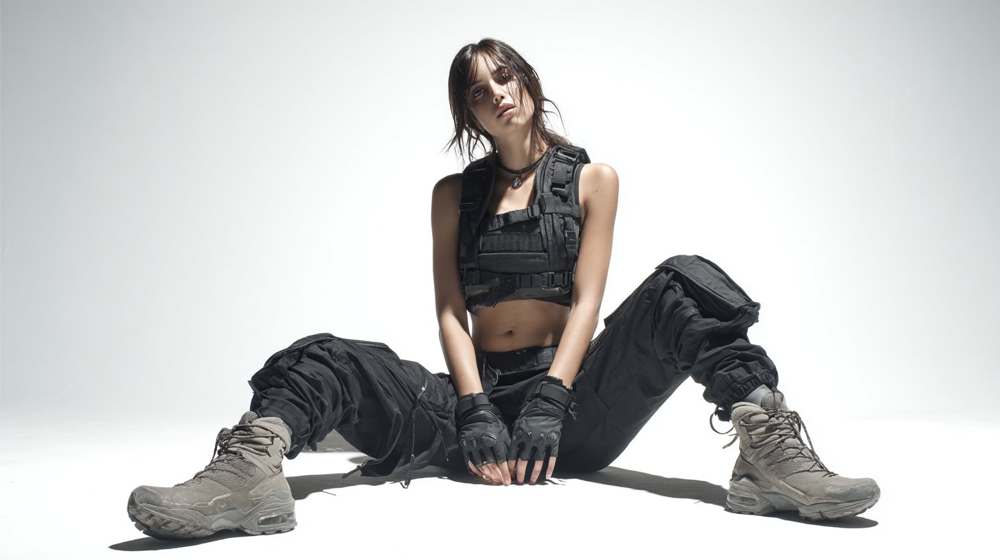

# 画像生成・動画生成AI用プロンプト一覧

本リポジトリは、世の中で使われている様々な画像生成・動画生成AI（Stable Diffusion、Midjourney、DALL·E、RunwayML、Pika など）向けのプロンプト例をまとめたものです。  
クリエイティブな作品制作やアイデア出しの参考としてご活用ください。

---

## 目次

- [対応AI一覧](#対応ai一覧)
- [プロンプトフォーマット例](#プロンプトフォーマット例)
- [プロンプト集](#プロンプト集)
  - [画像生成用プロンプト](#画像生成用プロンプト)
  - [動画生成用プロンプト](#動画生成用プロンプト)
- [使い方](#使い方)
- [注意事項](#注意事項)
- [参考リンク](#参考リンク)

---

## 対応AI一覧

- Stable Diffusion
- Midjourney
- nanobanana
- seedream
- KLING AI
- Sora2
- その他

---


## プロンプト集

### 画像生成用プロンプト

- **[FASHION PHOTOGRAPHY]([https://x.com/ZHO_ZHO_ZHO/status/1958539464994959715](https://x.com/CharaspowerAI/status/1977773842425643106))（by [@CharaspowerAI](https://x.com/CharaspowerAI))**




**プロンプト:**

```
A full-body shot of [character or person] wearing [detailed description of outfit: pants, shoes, top, accessories], posing for a photoshoot against a white background. High-fashion streetwear, with cinematic lighting and a wide-angle, hyper-realistic photography style, resulting in an ultra-detailed image. Minimalistic style of fashion photography.
```


---

### 動画生成用プロンプト


---

## 使い方

1. 対応するAIサービスのプロンプト入力欄に、上記のプロンプトをコピー＆ペーストしてください。
2. 必要に応じて、内容やパラメータ（例: --v 5, --ar 16:9 など）を調整してください。

---

## 注意事項

- 本プロンプト集は参考例です。生成結果はAIサービスやバージョンによって異なる場合があります。
- 著作権や利用規約を遵守してください。
- 商用利用される場合は、各AIサービスの規約をご確認ください。

---

## 参考リンク

- [Stable Diffusion公式](https://stability.ai/)
- [Midjourney公式](https://www.midjourney.com/)
- [DALL·E公式](https://openai.com/dall-e-2/)
- [RunwayML公式](https://runwayml.com/)
- [Pika公式](https://pika.art/)
